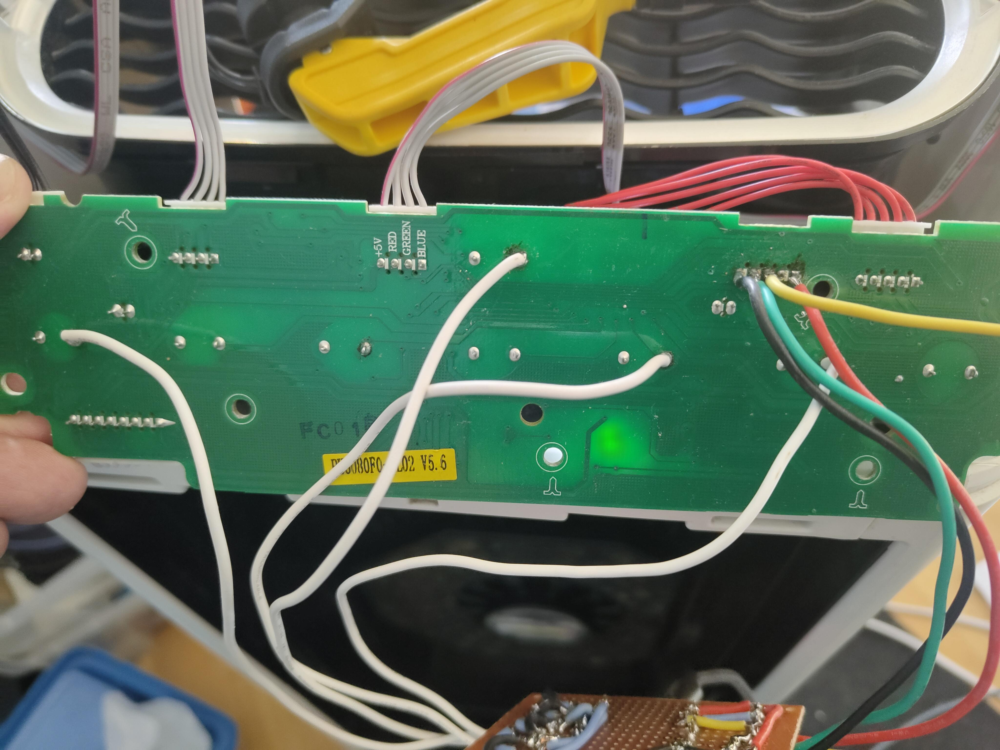
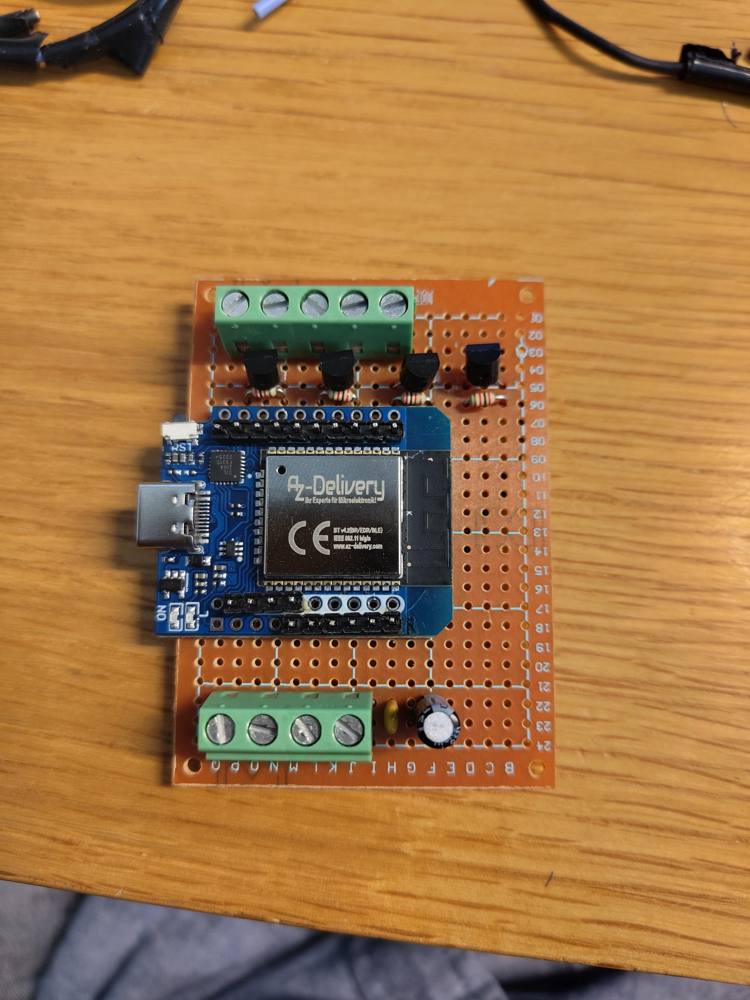
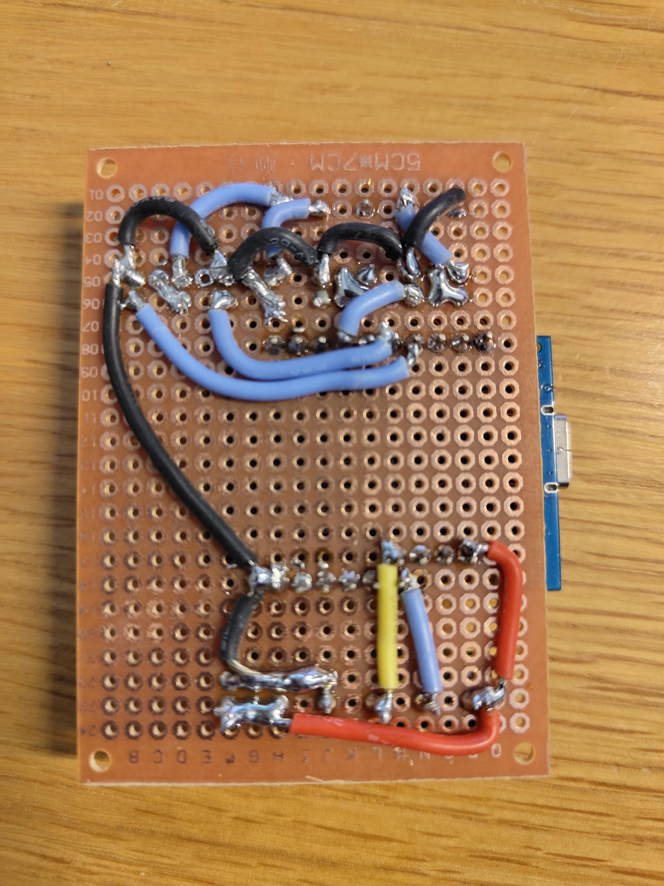
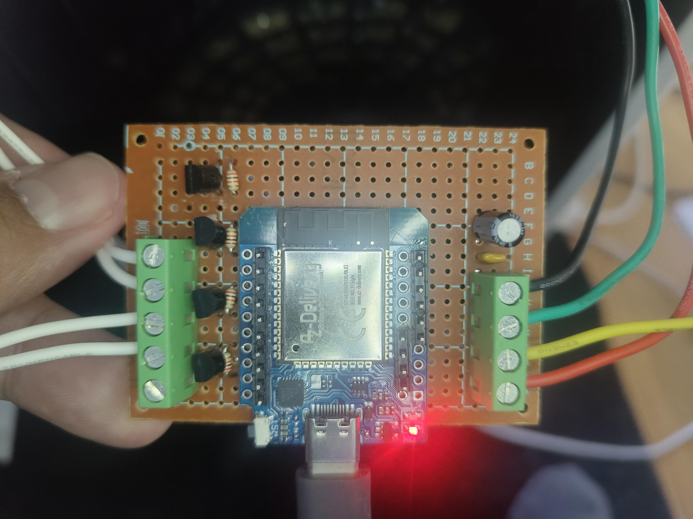
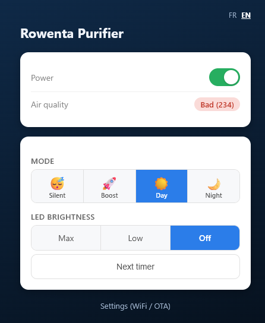
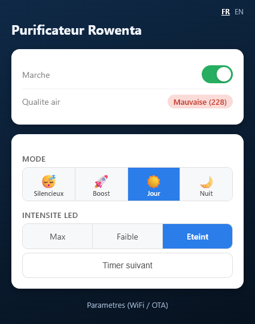

# Rowenta Intense Pure Air Connect XL — Local reconnection via ESP32 (no cloud) / Reconnexion locale via ESP32 (sans cloud)

Author / Auteur : **Xavier Hang** — [GitHub @vpxavier](https://github.com/vpxavier) — [X @vpxavier](https://x.com/vpxavier)

🇬🇧 [English](#english) · 🇫🇷 [Français](#français)

---

## 🇬🇧 English

### Why this project

The **Rowenta Intense Pure Air Connect XL (PU6080F0)** air purifier relied entirely on SEB/Rowenta's cloud servers for remote control through the **Pure Air** app. When those servers were shut down, the app became unusable: no more remote control, no more smart-home integration — even though the appliance itself still worked perfectly.

Rather than throwing away a device that was still mechanically and electrically fine, this project replaces the proprietary WiFi module (BroadLink) with an **ESP32** that talks directly to the purifier's mainboard locally, with no dependency on any external server.

### What was done

**Reverse-engineering the serial link**
- The original WiFi module communicates with the mainboard over **UART (9600 baud, 8N1)**, through a 5-pin connector (GND / TXD / RXD / WIFI-SW / +5V)
- The protocol was fully documented by passive listening: frame structure, checksum algorithm, and the meaning of the key fields (on/off state, mode, LED brightness, air-quality indicator)
- Attempts to send **direct commands** (changing mode via UART) failed — the original controller silently rejects unauthenticated frames, and the pairing handshake used by the official app could not be reproduced

**Solution that worked: touch simulation**
The panel buttons are **capacitive**, not mechanical. The working solution: simulate a finger press by driving a small NPN transistor from a GPIO pin, briefly grounding the button's contact point — exactly the effect a finger produces.

**Final result**
- An ESP32 replaces the BroadLink module, powered directly from the mainboard's +5V rail (no separate USB power needed)
- Continuous reading of the purifier's real state over UART
- Full control of the 4 buttons (Power, Mode, Light, Timer) by touch simulation
- **MQTT** integration with automatic **Home Assistant** discovery
- Built-in web interface to control the device without Home Assistant
- Over-the-air (OTA) firmware updates, no disassembly required

### Features

- ✅ Real-time reading: on/off, mode (Silent/Boost/Day/Night), LED brightness, air-quality indicator
- ✅ Full control of the 4 physical buttons via touch simulation
- ✅ Automatic Home Assistant integration via MQTT (switch, select, sensors)
- ✅ Standalone web interface (works even without Home Assistant), with automatic state refresh
- ✅ WiFi/MQTT configuration portal on first boot (no hardcoded credentials)
- ✅ Over-the-air firmware updates, password changeable from the web UI
- ✅ Automatic WiFi reconnection after a drop
- ✅ Hardware watchdog (reboots the device if it hangs)

### What doesn't work yet

- ❌ **Sending direct UART commands**: not possible without the original app's full pairing protocol — worked around via button simulation, which works very well in practice
- ❌ **Reading timer state**: this information is simply never transmitted over the UART link, it's only handled internally by the original microcontroller
- ⚠️ **Air quality in real units**: the reading is a **relative** indicator (empirically calibrated against the original LED color), not a measurement in µg/m³ or ppm — useful for thresholding, not for actual scientific measurement

### Hardware used

| Component | Reference / type | Qty |
|---|---|---|
| Microcontroller | ESP32 (AZ-Delivery D1 Mini, USB-C) | 1 |
| NPN transistor | PN2222 / PN2222ATA (TO-92) | 4 |
| Resistor | 2kΩ, 1/4W | 4 |
| Ceramic capacitor | 100nF | 1 |
| Electrolytic capacitor | 100µF / 16V | 1 |
| Screw terminal | 4-way, 5.08mm pitch | 1 |
| Screw terminal | 5-way, 5.08mm pitch | 1 |
| Mounting support | Perfboard, individual isolated pads | 1 |

The build was done on a **perfboard**, with point-to-point wiring (no custom etched PCB) — a faster approach with no manufacturing lead time.

### How to reproduce this project

1. **Locate the UART connector** on your Rowenta mainboard (5 pins: GND/TXD/RXD/WIFI-SW/+5V) and disconnect the original BroadLink module
2. **Wire the ESP32**:
   - Rowenta GND → ESP32 GND
   - Rowenta TXD → GPIO16 (ESP32 receives)
   - Rowenta RXD → GPIO4 (ESP32 transmits)
   - Rowenta +5V → ESP32 VCC (power)
3. **Wire the 4 transistors** (base → 2kΩ resistor → GPIO, emitter → common GND, collector → matching button spring):
   - POWER → GPIO18
   - LIGHT → GPIO19
   - MODE → GPIO23
   - TIMER → GPIO5
4. **Flash the firmware** (`firmware/firmware_rowenta_intense_pure_air_connect_xl_mqtt_bridge.ino`) via Arduino IDE (board "ESP32 Dev Module", requires the **PubSubClient3** library)
5. **First boot**: connect to the `Rowenta-Setup` WiFi access point, configure your WiFi network and MQTT broker
6. **Home Assistant** automatically detects the device via MQTT Discovery — or use the built-in web interface directly at the ESP32's IP address

The full wiring diagram and detailed component list with supplier references are available in this repository.

### Photos

| | |
|---|---|
|  | **Rowenta mainboard** — solder points with white wires running to the capacitive touch buttons, plus the original connector that used to feed the (now disconnected) WiFi module. |
|  | **Assembled bridge, top view** — ESP32 module (AZ-Delivery), CN1/CN2 terminal blocks, transistors and resistors. |
|  | **Back of the board** — point-to-point wiring and solder joints. |
|  | **Final assembly, powered and running.** |
|  | **Built-in web interface** — live state, power toggle, mode icons, LED brightness, and timer button. A FR/EN language switch is available at the top of the page. |

### Schematic

The full circuit schematic (ESP32 headers, terminal blocks, transistors, resistors, capacitors) is available online, viewable directly in the browser, no account required:

🔗 **[View the schematic on EasyEDA / OSHWLab](https://oshwlab.com/vpxavier/project_lpgqjtzl)**

### License

This project is distributed under the **[Creative Commons BY-NC-SA 4.0](https://creativecommons.org/licenses/by-nc-sa/4.0/)** license:
- ✅ Free to share and adapt
- ✅ Attribution required (credit Xavier Hang / [GitHub @vpxavier](https://github.com/vpxavier) / [X @vpxavier](https://x.com/vpxavier))
- ❌ Commercial use not permitted
- 🔁 Any derivative work must be shared under the same license

### Disclaimer

This project involves modifying the internal electronics of a mains-powered appliance. It is provided for educational purposes, with no warranty. Any reproduction is undertaken at your own risk.

---

## 🇫🇷 Français

### Pourquoi ce projet

Le purificateur d'air **Rowenta Intense Pure Air Connect XL (PU6080F0)** dépendait entièrement des serveurs cloud SEB/Rowenta pour son contrôle à distance via l'application **Pure Air**. Lorsque ces serveurs ont été fermés, l'application est devenue inutilisable : plus aucun contrôle à distance, plus d'intégration domotique possible, alors que l'appareil lui-même fonctionnait toujours parfaitement.

Plutôt que de jeter un appareil matériellement fonctionnel, ce projet remplace le module WiFi propriétaire (BroadLink) par un **ESP32**, qui dialogue directement avec la carte mère du purificateur en local, sans dépendre d'aucun serveur externe.

### Ce qui a été fait

**Reverse engineering de la liaison série**
- Le module WiFi d'origine communique avec la carte mère via **UART (9600 bauds, 8N1)**, sur un connecteur à 5 broches (GND / TXD / RXD / WIFI-SW / +5V)
- Le protocole a été entièrement documenté par écoute passive : structure des trames, algorithme de checksum, et signification des principaux champs (état marche/arrêt, mode, intensité LED, indicateur de qualité d'air)
- Les tentatives d'envoi de **commandes directes** (changer le mode par UART) ont échoué — le contrôleur d'origine rejette silencieusement les trames sans authentification, qu'il n'a pas été possible de reproduire sans l'application d'origine

**Solution retenue : simulation de contact tactile**
Les boutons du panneau sont **capacitifs**, pas mécaniques. La solution qui fonctionne : simuler une pression du doigt en pilotant un petit transistor NPN par GPIO, qui vient brièvement mettre à la masse le point de contact du bouton — exactement l'effet obtenu par un doigt.

**Résultat final**
- Un ESP32 remplace le module BroadLink, alimenté directement par le +5V de la carte mère (pas d'alimentation USB séparée nécessaire)
- Lecture en continu de l'état réel de l'appareil via UART
- Pilotage des 4 boutons (Marche/Arrêt, Mode, Lumière, Minuterie) par simulation de contact
- Intégration **MQTT** avec découverte automatique **Home Assistant**
- Interface web embarquée pour piloter l'appareil sans Home Assistant
- Mises à jour du firmware par WiFi (OTA), sans redémontage

### Fonctionnalités

- ✅ Lecture en temps réel : marche/arrêt, mode (Silencieux/Boost/Jour/Nuit), intensité LED, indicateur de qualité d'air
- ✅ Contrôle complet des 4 boutons physiques par simulation de contact
- ✅ Intégration Home Assistant automatique via MQTT (switch, select, capteurs)
- ✅ Interface web autonome (fonctionne même sans Home Assistant), avec actualisation automatique de l'état
- ✅ Portail de configuration WiFi/MQTT au premier démarrage (pas d'identifiants codés en dur)
- ✅ Mise à jour du firmware par WiFi (OTA), mot de passe modifiable depuis l'interface web
- ✅ Reconnexion WiFi automatique en cas de coupure
- ✅ Chien de garde matériel (redémarre l'appareil s'il se bloque)

### Ce qui ne fonctionne pas (encore)

- ❌ **Envoi de commandes directes par UART** : impossible sans le protocole d'appairage complet de l'application d'origine — contournement par simulation de bouton, qui fonctionne très bien en pratique
- ❌ **Lecture de l'état de la minuterie** : cette information n'est simplement jamais transmise sur la liaison UART, uniquement gérée en interne par le microcontrôleur d'origine
- ⚠️ **Qualité d'air en unités réelles** : la valeur lue est un indicateur **relatif** (calibré empiriquement selon la couleur de la LED d'origine), pas une mesure en µg/m³ ou ppm — utile pour du seuillage, pas pour une vraie mesure scientifique

### Matériel utilisé

| Composant | Référence / type | Quantité |
|---|---|---|
| Microcontrôleur | ESP32 (AZ-Delivery D1 Mini, USB-C) | 1 |
| Transistor NPN | PN2222 / PN2222ATA (TO-92) | 4 |
| Résistance | 2kΩ, 1/4W | 4 |
| Condensateur céramique | 100nF | 1 |
| Condensateur électrolytique | 100µF / 16V | 1 |
| Bornier à vis | 4 voies, pas 5.08mm | 1 |
| Bornier à vis | 5 voies, pas 5.08mm | 1 |
| Support de montage | Carte perforée (perfboard), pastilles individuelles | 1 |

Le montage a été réalisé sur **carte perforée**, avec câblage point à point (pas de circuit imprimé gravé sur mesure) — une approche plus rapide à mettre en œuvre, sans délai de fabrication.

### Procédure pour refaire ce projet

1. **Identifier le connecteur UART** sur votre carte mère Rowenta (5 broches : GND/TXD/RXD/WIFI-SW/+5V) et débrancher le module BroadLink d'origine
2. **Câbler l'ESP32** :
   - GND Rowenta → GND ESP32
   - TXD Rowenta → GPIO16 (ESP32 reçoit)
   - RXD Rowenta → GPIO4 (ESP32 transmet)
   - +5V Rowenta → VCC ESP32 (alimentation)
3. **Câbler les 4 transistors** (base → résistance 2kΩ → GPIO, émetteur → GND commun, collecteur → ressort du bouton correspondant) :
   - POWER → GPIO18
   - LIGHT → GPIO19
   - MODE → GPIO23
   - TIMER → GPIO5
4. **Flasher le firmware** (`firmware/firmware_rowenta_intense_pure_air_connect_xl_mqtt_bridge.ino`) via Arduino IDE (carte "ESP32 Dev Module", bibliothèque **PubSubClient3** requise)
5. **Premier démarrage** : connectez-vous au point d'accès WiFi `Rowenta-Setup`, configurez votre réseau WiFi et votre broker MQTT
6. **Home Assistant** détecte automatiquement l'appareil via MQTT Discovery — ou utilisez directement l'interface web embarquée à l'adresse IP de l'ESP32

Le schéma de câblage complet et la liste de composants détaillée avec références fournisseur sont disponibles dans ce dépôt.

### Photos

| | |
|---|---|
|  | **Carte mère Rowenta** — points de soudure avec les fils blancs allant vers les boutons tactiles, ainsi que le connecteur d'origine qui alimentait le module WiFi (aujourd'hui débranché). |
|  | **Montage assemblé, vue de dessus** — module ESP32 (AZ-Delivery), borniers CN1/CN2, transistors et résistances. |
|  | **Face arrière de la carte** — câblage point à point et soudures. |
|  | **Montage final, alimenté et en fonctionnement.** |
|  | **Interface web embarquée** — état en direct, interrupteur marche/arrêt, icônes de mode, intensité LED, et bouton minuterie. Un sélecteur de langue FR/EN est disponible en haut de la page. |

### Schéma électrique

Le schéma complet du montage (headers ESP32, borniers, transistors, résistances, condensateurs) est disponible en ligne, consultable directement dans le navigateur sans compte requis :

🔗 **[Voir le schéma sur EasyEDA / OSHWLab](https://oshwlab.com/vpxavier/project_lpgqjtzl)**

### Licence

Ce projet est distribué sous licence **[Creative Commons BY-NC-SA 4.0](https://creativecommons.org/licenses/by-nc-sa/4.0/)** :
- ✅ Partage et adaptation libres
- ✅ Attribution requise (créditez Xavier Hang / [GitHub @vpxavier](https://github.com/vpxavier) / [X @vpxavier](https://x.com/vpxavier))
- ❌ Usage commercial non autorisé
- 🔁 Toute œuvre dérivée doit être partagée sous la même licence

### Avertissement

Ce projet implique de modifier l'électronique interne d'un appareil sous tension secteur. Il est fourni à titre éducatif, sans garantie. Toute reproduction se fait sous votre propre responsabilité.
